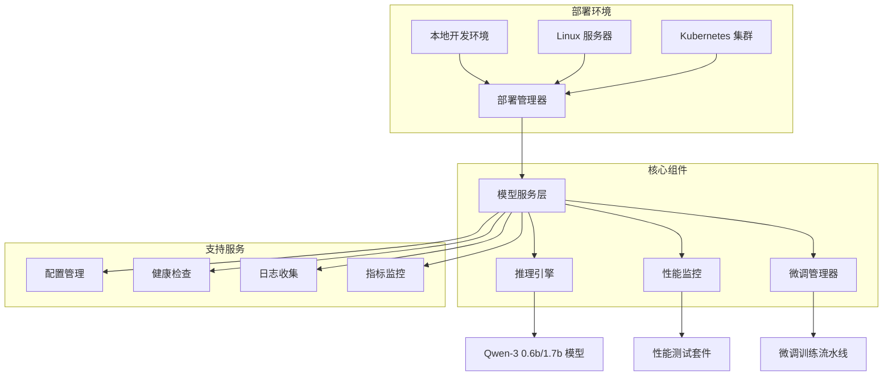

# Qwen-3 模型部署与优化设计文档

## 概述

本设计文档基于需求文档，详细描述了 Qwen-3 系列模型（0.6b 和 1.7b）的完整部署、性能测试和微调解决方案的技术架构。系统将支持本地部署、服务器部署、Kubernetes 容器化部署，以及无 GPU 环境下的性能优化和基于通话语义的投诉分类微调。

## 架构

### 整体架构图



### 技术栈选择

#### 本地开发环境（简化方案）
- **推理引擎**: Ollama（已部署）+ LMDeploy（可选优化）
- **可观测性**: 简化日志 + 基础性能监控
- **性能测试**: 轻量级 Python 脚本
- **微调框架**: Transformers + LoRA
- **监控**: 文件日志 + 简单 Web 界面

#### 生产环境（完整方案）
- **推理引擎**: LMDeploy（支持 CPU 优化、量化、KV 缓存）
- **容器化**: Docker + Kubernetes
- **服务框架**: FastAPI（RESTful API）
- **性能测试**: Locust + 自定义性能分析工具
- **微调框架**: Transformers + LoRA/QLoRA
- **监控**: Prometheus + Grafana
- **包管理**: Helm Charts

## 组件和接口

### 1. 部署管理器 (Deployment Manager)

#### 1.1 本地部署组件（简化方案）

##### Ollama 集成组件
```python
class OllamaIntegration:
    def __init__(self, base_url: str = "http://localhost:11434"):
        self.base_url = base_url
        self.session = requests.Session()
        
    def check_ollama_status(self) -> bool:
        """检查 Ollama 服务状态"""
        try:
            response = self.session.get(f"{self.base_url}/api/tags")
            return response.status_code == 200
        except:
            return False
            
    def list_models(self) -> List[str]:
        """获取可用模型列表"""
        
    def inference_with_metrics(self, model: str, prompt: str) -> Dict:
        """带指标收集的推理"""
        start_time = time.time()
        try:
            response = self.session.post(
                f"{self.base_url}/api/generate",
                json={
                    "model": model,
                    "prompt": prompt,
                    "stream": False
                }
            )
            end_time = time.time()
            
            result = {
                "response": response.json().get("response", ""),
                "latency_ms": (end_time - start_time) * 1000,
                "status_code": response.status_code,
                "timestamp": datetime.now().isoformat()
            }
            
            # 简单日志记录
            self._log_metrics(result)
            return result
            
        except Exception as e:
            return {"error": str(e), "timestamp": datetime.now().isoformat()}
            
    def _log_metrics(self, metrics: Dict):
        """记录指标到文件"""
        log_file = "ollama_metrics.jsonl"
        with open(log_file, "a") as f:
            f.write(json.dumps(metrics, ensure_ascii=False) + "\n")
```

##### 简化性能监控组件
```python
class SimplePerformanceMonitor:
    def __init__(self, log_file: str = "performance.log"):
        self.log_file = log_file
        self.metrics = []
        
    def start_monitoring(self):
        """开始监控系统指标"""
        
    def collect_system_metrics(self) -> Dict:
        """收集系统指标"""
        import psutil
        return {
            "cpu_percent": psutil.cpu_percent(),
            "memory_percent": psutil.virtual_memory().percent,
            "memory_used_mb": psutil.virtual_memory().used / 1024 / 1024,
            "timestamp": datetime.now().isoformat()
        }
        
    def log_performance(self, metrics: Dict):
        """记录性能数据"""
        with open(self.log_file, "a") as f:
            f.write(f"{datetime.now()}: {json.dumps(metrics)}\n")
            
    def generate_simple_report(self) -> str:
        """生成简单报告"""
        # 读取最近的指标数据并生成报告
        pass
```

#### 1.2 本地部署组件（完整方案）
```python
class LocalDeployment:
    def __init__(self, model_path: str, config: Dict):
        self.model_path = model_path
        self.config = config
        
    def setup_environment(self) -> bool:
        """设置本地环境依赖"""
        
    def deploy_model(self) -> bool:
        """部署模型到本地环境"""
        
    def validate_deployment(self) -> bool:
        """验证部署状态"""
```

**接口设计**:
- `POST /api/v1/local/deploy` - 启动本地部署
- `GET /api/v1/local/status` - 检查部署状态
- `DELETE /api/v1/local/cleanup` - 清理部署

#### 1.2 服务器部署组件
```python
class ServerDeployment:
    def __init__(self, server_config: Dict):
        self.server_config = server_config
        
    def deploy_service(self) -> bool:
        """部署服务到 Linux 服务器"""
        
    def configure_systemd(self) -> bool:
        """配置 systemd 服务"""
        
    def setup_load_balancer(self) -> bool:
        """配置负载均衡"""
```

#### 1.3 Kubernetes 部署组件
```python
class KubernetesDeployment:
    def __init__(self, k8s_config: Dict):
        self.k8s_config = k8s_config
        
    def build_docker_image(self) -> str:
        """构建 Docker 镜像"""
        
    def deploy_to_k8s(self) -> bool:
        """部署到 Kubernetes 集群"""
        
    def setup_hpa(self) -> bool:
        """配置水平自动扩缩容"""
```

**Kubernetes 资源配置**:
```yaml
# Deployment 配置
apiVersion: apps/v1
kind: Deployment
metadata:
  name: qwen3-inference
spec:
  replicas: 3
  selector:
    matchLabels:
      app: qwen3-inference
  template:
    spec:
      containers:
      - name: qwen3-server
        image: qwen3-inference:latest
        resources:
          requests:
            memory: "4Gi"
            cpu: "2"
          limits:
            memory: "8Gi"
            cpu: "4"
        readinessProbe:
          httpGet:
            path: /health
            port: 8000
          initialDelaySeconds: 30
          periodSeconds: 10
```

### 2. 模型服务层 (Model Service Layer)

#### 2.1 推理服务
```python
class InferenceService:
    def __init__(self, model_name: str, optimization_config: Dict):
        self.model_name = model_name
        self.optimization_config = optimization_config
        self.engine = LMDeployEngine(model_name, optimization_config)
        
    async def predict(self, input_text: str) -> Dict:
        """模型推理接口"""
        
    def get_model_info(self) -> Dict:
        """获取模型信息"""
```

**API 接口设计**:
```yaml
openapi: 3.0.0
paths:
  /api/v1/inference:
    post:
      summary: 模型推理
      requestBody:
        content:
          application/json:
            schema:
              type: object
              properties:
                text:
                  type: string
                max_tokens:
                  type: integer
                temperature:
                  type: number
      responses:
        200:
          description: 推理结果
          content:
            application/json:
              schema:
                type: object
                properties:
                  result:
                    type: string
                  tokens_used:
                    type: integer
                  response_time:
                    type: number
```

#### 2.2 优化引擎
```python
class OptimizationEngine:
    def __init__(self):
        self.quantization_config = {}
        self.kv_cache_config = {}
        
    def apply_quantization(self, model_path: str) -> str:
        """应用模型量化"""
        
    def optimize_kv_cache(self, config: Dict) -> Dict:
        """优化 KV 缓存配置"""
        
    def tune_cpu_inference(self) -> Dict:
        """CPU 推理优化"""
```

### 3. 性能测试套件 (Performance Testing Suite)

#### 3.1 简化本地测试组件
```python
class SimpleLocalTester:
    def __init__(self, ollama_integration: OllamaIntegration):
        self.ollama = ollama_integration
        self.results = []
        
    def run_basic_qps_test(self, model: str, test_prompts: List[str], 
                          concurrent_users: int = 5, duration: int = 60) -> Dict:
        """运行基础 QPS 测试"""
        import threading
        import time
        from concurrent.futures import ThreadPoolExecutor
        
        results = []
        start_time = time.time()
        end_time = start_time + duration
        
        def worker():
            while time.time() < end_time:
                for prompt in test_prompts:
                    result = self.ollama.inference_with_metrics(model, prompt)
                    results.append(result)
                    
        with ThreadPoolExecutor(max_workers=concurrent_users) as executor:
            futures = [executor.submit(worker) for _ in range(concurrent_users)]
            
        # 计算指标
        total_requests = len(results)
        successful_requests = len([r for r in results if 'error' not in r])
        avg_latency = sum(r.get('latency_ms', 0) for r in results) / len(results)
        qps = total_requests / duration
        
        summary = {
            "total_requests": total_requests,
            "successful_requests": successful_requests,
            "error_rate": (total_requests - successful_requests) / total_requests,
            "avg_latency_ms": avg_latency,
            "qps": qps,
            "test_duration": duration,
            "concurrent_users": concurrent_users
        }
        
        self._save_test_results(summary, results)
        return summary
        
    def run_latency_test(self, model: str, test_prompts: List[str], 
                        iterations: int = 100) -> Dict:
        """运行延迟测试"""
        latencies = []
        
        for i in range(iterations):
            prompt = test_prompts[i % len(test_prompts)]
            result = self.ollama.inference_with_metrics(model, prompt)
            if 'latency_ms' in result:
                latencies.append(result['latency_ms'])
                
        latencies.sort()
        summary = {
            "iterations": iterations,
            "avg_latency_ms": sum(latencies) / len(latencies),
            "min_latency_ms": min(latencies),
            "max_latency_ms": max(latencies),
            "p50_latency_ms": latencies[len(latencies)//2],
            "p95_latency_ms": latencies[int(len(latencies)*0.95)],
            "p99_latency_ms": latencies[int(len(latencies)*0.99)]
        }
        
        return summary
        
    def _save_test_results(self, summary: Dict, detailed_results: List[Dict]):
        """保存测试结果"""
        timestamp = datetime.now().strftime("%Y%m%d_%H%M%S")
        
        # 保存摘要
        with open(f"test_summary_{timestamp}.json", "w") as f:
            json.dump(summary, f, indent=2, ensure_ascii=False)
            
        # 保存详细结果
        with open(f"test_details_{timestamp}.jsonl", "w") as f:
            for result in detailed_results:
                f.write(json.dumps(result, ensure_ascii=False) + "\n")
                
    def generate_simple_html_report(self, summary: Dict) -> str:
        """生成简单的 HTML 报告"""
        html_template = """
        <!DOCTYPE html>
        <html>
        <head>
            <title>Qwen-3 性能测试报告</title>
            <style>
                body {{ font-family: Arial, sans-serif; margin: 20px; }}
                .metric {{ margin: 10px 0; padding: 10px; background: #f5f5f5; }}
                .good {{ color: green; }}
                .warning {{ color: orange; }}
                .error {{ color: red; }}
            </style>
        </head>
        <body>
            <h1>Qwen-3 性能测试报告</h1>
            <div class="metric">QPS: {qps:.2f}</div>
            <div class="metric">平均延迟: {avg_latency_ms:.2f}ms</div>
            <div class="metric">错误率: {error_rate:.2%}</div>
            <div class="metric">成功请求: {successful_requests}/{total_requests}</div>
            <div class="metric">并发用户: {concurrent_users}</div>
            <div class="metric">测试时长: {test_duration}s</div>
        </body>
        </html>
        """.format(**summary)
        
        report_file = f"performance_report_{datetime.now().strftime('%Y%m%d_%H%M%S')}.html"
        with open(report_file, "w", encoding="utf-8") as f:
            f.write(html_template)
            
        return report_file
```

#### 3.2 性能测试管理器（完整方案）
```python
class PerformanceTestManager:
    def __init__(self, test_config: Dict):
        self.test_config = test_config
        self.metrics_collector = MetricsCollector()
        
    def run_qps_test(self, concurrent_users: int, duration: int) -> Dict:
        """QPS 性能测试"""
        
    def run_latency_test(self, request_count: int) -> Dict:
        """延迟测试"""
        
    def run_stress_test(self, max_concurrent: int) -> Dict:
        """压力测试"""
        
    def generate_report(self, test_results: List[Dict]) -> str:
        """生成性能测试报告"""
```

#### 3.2 指标收集器
```python
class MetricsCollector:
    def collect_system_metrics(self) -> Dict:
        """收集系统指标（CPU、内存、磁盘）"""
        
    def collect_inference_metrics(self) -> Dict:
        """收集推理指标（QPS、RT、吞吐量）"""
        
    def collect_model_metrics(self) -> Dict:
        """收集模型指标（内存使用、加载时间）"""
```

### 4. 微调管理器 (Fine-tuning Manager)

#### 4.1 数据预处理器
```python
class DataPreprocessor:
    def __init__(self, data_config: Dict):
        self.data_config = data_config
        
    def preprocess_call_semantics(self, raw_data: List[Dict]) -> List[Dict]:
        """预处理通话语义数据"""
        
    def create_complaint_labels(self, data: List[Dict]) -> Dict:
        """创建投诉分类标签"""
        
    def split_dataset(self, data: List[Dict]) -> Tuple[List, List, List]:
        """分割训练、验证、测试数据集"""
```

#### 4.2 微调训练器
```python
class FineTuningTrainer:
    def __init__(self, model_config: Dict, training_config: Dict):
        self.model_config = model_config
        self.training_config = training_config
        
    def setup_lora_config(self) -> Dict:
        """配置 LoRA 参数"""
        
    def train_model(self, train_data: List[Dict]) -> str:
        """执行微调训练"""
        
    def evaluate_model(self, test_data: List[Dict]) -> Dict:
        """评估微调模型"""
        
    def save_checkpoint(self, epoch: int) -> str:
        """保存训练检查点"""
```

## 数据模型

### 1. 配置数据模型

```python
@dataclass
class DeploymentConfig:
    model_name: str
    model_version: str
    deployment_type: str  # local, server, kubernetes
    resource_limits: ResourceLimits
    optimization_settings: OptimizationSettings

@dataclass
class ResourceLimits:
    cpu_cores: int
    memory_gb: int
    disk_gb: int
    gpu_count: int = 0

@dataclass
class OptimizationSettings:
    enable_quantization: bool
    quantization_bits: int
    enable_kv_cache: bool
    max_batch_size: int
    max_sequence_length: int
```

### 2. 性能测试数据模型

```python
@dataclass
class PerformanceMetrics:
    timestamp: datetime
    qps: float
    avg_latency_ms: float
    p95_latency_ms: float
    p99_latency_ms: float
    cpu_usage_percent: float
    memory_usage_mb: float
    error_rate_percent: float

@dataclass
class TestResult:
    test_id: str
    test_type: str
    model_version: str
    configuration: Dict
    metrics: List[PerformanceMetrics]
    summary: Dict
```

### 3. 微调数据模型

```python
@dataclass
class TrainingData:
    conversation_id: str
    input_text: str
    complaint_category: str
    confidence_score: float
    metadata: Dict

@dataclass
class FineTuningResult:
    model_id: str
    base_model: str
    training_config: Dict
    evaluation_metrics: Dict
    model_path: str
    created_at: datetime
```

## 错误处理

### 1. 部署错误处理

```python
class DeploymentError(Exception):
    """部署相关错误基类"""
    pass

class ModelLoadError(DeploymentError):
    """模型加载错误"""
    pass

class ResourceInsufficientError(DeploymentError):
    """资源不足错误"""
    pass

class ConfigurationError(DeploymentError):
    """配置错误"""
    pass
```

### 2. 错误恢复策略

- **模型加载失败**: 自动重试 3 次，降级到备用模型
- **内存不足**: 自动调整批处理大小，启用内存优化
- **网络连接失败**: 指数退避重试，最大重试 5 次
- **Kubernetes Pod 失败**: 自动重启，健康检查失败时替换 Pod

### 3. 监控和告警

```python
class AlertManager:
    def setup_alerts(self):
        """配置告警规则"""
        alerts = [
            Alert("high_latency", "avg_latency > 1000ms", "warning"),
            Alert("low_qps", "qps < 10", "warning"),
            Alert("high_error_rate", "error_rate > 5%", "critical"),
            Alert("memory_usage", "memory_usage > 80%", "warning"),
            Alert("pod_restart", "pod_restart_count > 3", "critical")
        ]
        return alerts
```

## 测试策略

### 1. 单元测试
- 模型加载和推理功能测试
- 配置解析和验证测试
- 数据预处理功能测试
- API 接口测试

### 2. 集成测试
- 端到端部署流程测试
- 性能测试流水线测试
- 微调训练流程测试
- Kubernetes 部署测试

### 3. 性能测试
- 基准性能测试（QPS、延迟）
- 压力测试（最大并发、资源限制）
- 稳定性测试（长时间运行）
- 优化效果对比测试

### 4. 安全测试
- API 安全测试
- 容器安全扫描
- 配置安全检查
- 数据隐私保护测试

## 部署策略

### 1. 本地部署策略
- 使用 Python 虚拟环境隔离依赖
- 自动检测和安装系统依赖
- 提供一键部署脚本
- 支持开发模式和生产模式

### 2. 服务器部署策略
- 使用 systemd 管理服务生命周期
- 配置日志轮转和监控
- 支持多实例负载均衡
- 提供滚动更新机制

### 3. Kubernetes 部署策略
- 使用 Helm Charts 管理部署
- 配置 HPA 自动扩缩容
- 实现蓝绿部署和金丝雀发布
- 集成服务网格（可选）

### 4. 配置管理策略
- 使用 ConfigMap 管理应用配置
- 使用 Secret 管理敏感信息
- 支持环境变量覆盖
- 提供配置热更新机制

## 监控和可观测性

### 0. 本地简化监控方案

#### 简单文件日志监控
```python
class SimpleFileMonitor:
    def __init__(self, log_dir: str = "./logs"):
        self.log_dir = log_dir
        os.makedirs(log_dir, exist_ok=True)
        
    def log_request(self, model: str, prompt: str, response: str, 
                   latency_ms: float, error: str = None):
        """记录请求日志"""
        log_entry = {
            "timestamp": datetime.now().isoformat(),
            "model": model,
            "prompt_length": len(prompt),
            "response_length": len(response) if response else 0,
            "latency_ms": latency_ms,
            "error": error,
            "status": "error" if error else "success"
        }
        
        log_file = os.path.join(self.log_dir, f"requests_{datetime.now().strftime('%Y%m%d')}.jsonl")
        with open(log_file, "a") as f:
            f.write(json.dumps(log_entry, ensure_ascii=False) + "\n")
            
    def log_system_metrics(self):
        """记录系统指标"""
        import psutil
        metrics = {
            "timestamp": datetime.now().isoformat(),
            "cpu_percent": psutil.cpu_percent(interval=1),
            "memory_percent": psutil.virtual_memory().percent,
            "memory_used_gb": psutil.virtual_memory().used / 1024**3,
            "disk_usage_percent": psutil.disk_usage('/').percent
        }
        
        log_file = os.path.join(self.log_dir, f"system_{datetime.now().strftime('%Y%m%d')}.jsonl")
        with open(log_file, "a") as f:
            f.write(json.dumps(metrics) + "\n")
            
    def generate_daily_summary(self, date: str = None) -> Dict:
        """生成日度摘要报告"""
        if not date:
            date = datetime.now().strftime('%Y%m%d')
            
        request_file = os.path.join(self.log_dir, f"requests_{date}.jsonl")
        system_file = os.path.join(self.log_dir, f"system_{date}.jsonl")
        
        summary = {
            "date": date,
            "total_requests": 0,
            "successful_requests": 0,
            "error_requests": 0,
            "avg_latency_ms": 0,
            "max_latency_ms": 0,
            "avg_cpu_percent": 0,
            "max_memory_percent": 0
        }
        
        # 分析请求日志
        if os.path.exists(request_file):
            latencies = []
            with open(request_file, 'r') as f:
                for line in f:
                    entry = json.loads(line)
                    summary["total_requests"] += 1
                    if entry["status"] == "success":
                        summary["successful_requests"] += 1
                        latencies.append(entry["latency_ms"])
                    else:
                        summary["error_requests"] += 1
                        
            if latencies:
                summary["avg_latency_ms"] = sum(latencies) / len(latencies)
                summary["max_latency_ms"] = max(latencies)
                
        # 分析系统指标
        if os.path.exists(system_file):
            cpu_values = []
            memory_values = []
            with open(system_file, 'r') as f:
                for line in f:
                    entry = json.loads(line)
                    cpu_values.append(entry["cpu_percent"])
                    memory_values.append(entry["memory_percent"])
                    
            if cpu_values:
                summary["avg_cpu_percent"] = sum(cpu_values) / len(cpu_values)
            if memory_values:
                summary["max_memory_percent"] = max(memory_values)
                
        return summary
```

#### 简单 Web 仪表盘
```python
from flask import Flask, render_template, jsonify

class SimpleWebDashboard:
    def __init__(self, monitor: SimpleFileMonitor, port: int = 5000):
        self.monitor = monitor
        self.app = Flask(__name__)
        self.port = port
        self._setup_routes()
        
    def _setup_routes(self):
        @self.app.route('/')
        def dashboard():
            return render_template('dashboard.html')
            
        @self.app.route('/api/summary')
        def get_summary():
            summary = self.monitor.generate_daily_summary()
            return jsonify(summary)
            
        @self.app.route('/api/recent_requests')
        def get_recent_requests():
            # 返回最近 100 条请求记录
            return jsonify(self._get_recent_logs(100))
            
    def _get_recent_logs(self, limit: int = 100) -> List[Dict]:
        """获取最近的日志记录"""
        today = datetime.now().strftime('%Y%m%d')
        log_file = os.path.join(self.monitor.log_dir, f"requests_{today}.jsonl")
        
        logs = []
        if os.path.exists(log_file):
            with open(log_file, 'r') as f:
                lines = f.readlines()
                for line in lines[-limit:]:
                    logs.append(json.loads(line))
        return logs
        
    def run(self, debug: bool = True):
        """启动 Web 仪表盘"""
        self.app.run(host='0.0.0.0', port=self.port, debug=debug)
```

#### 一键启动脚本
```python
# simple_monitor.py - 一键启动本地监控
class LocalMonitoringSetup:
    def __init__(self):
        self.ollama = OllamaIntegration()
        self.monitor = SimpleFileMonitor()
        self.tester = SimpleLocalTester(self.ollama)
        
    def start_monitoring(self):
        """启动监控"""
        print("🚀 启动 Qwen-3 本地监控...")
        
        # 检查 Ollama 状态
        if not self.ollama.check_ollama_status():
            print("❌ Ollama 服务未运行，请先启动 Ollama")
            return
            
        print("✅ Ollama 服务正常")
        
        # 启动系统指标收集
        import threading
        def collect_metrics():
            while True:
                self.monitor.log_system_metrics()
                time.sleep(60)  # 每分钟收集一次
                
        metrics_thread = threading.Thread(target=collect_metrics, daemon=True)
        metrics_thread.start()
        
        print("✅ 系统指标收集已启动")
        
        # 启动 Web 仪表盘
        dashboard = SimpleWebDashboard(self.monitor)
        print("✅ Web 仪表盘已启动: http://localhost:5000")
        
        dashboard.run()
        
    def run_quick_test(self, model: str = "qwen3:0.6b"):
        """运行快速测试"""
        print(f"📊 开始对 {model} 进行快速性能测试...")
        
        test_prompts = [
            "你好，请介绍一下你自己。",
            "请解释一下人工智能的基本概念。",
            "写一个简单的 Python 函数来计算阶乘。"
        ]
        
        # 运行延迟测试
        latency_result = self.tester.run_latency_test(model, test_prompts, 10)
        print(f"✅ 延迟测试完成: 平均 {latency_result['avg_latency_ms']:.2f}ms")
        
        # 运行简单 QPS 测试
        qps_result = self.tester.run_basic_qps_test(model, test_prompts, 2, 30)
        print(f"✅ QPS 测试完成: {qps_result['qps']:.2f} QPS")
        
        # 生成报告
        report_file = self.tester.generate_simple_html_report(qps_result)
        print(f"✅ 性能报告已生成: {report_file}")
        
if __name__ == "__main__":
    setup = LocalMonitoringSetup()
    
    import sys
    if len(sys.argv) > 1 and sys.argv[1] == "test":
        setup.run_quick_test()
    else:
        setup.start_monitoring()
```

### 1. 指标监控（生产环境）
```yaml
# Prometheus 监控指标
metrics:
  - name: qwen3_inference_requests_total
    type: counter
    help: "Total number of inference requests"
    
  - name: qwen3_inference_duration_seconds
    type: histogram
    help: "Inference request duration"
    
  - name: qwen3_model_memory_usage_bytes
    type: gauge
    help: "Model memory usage in bytes"
    
  - name: qwen3_active_connections
    type: gauge
    help: "Number of active connections"
```

### 2. 日志管理
- 结构化日志输出（JSON 格式）
- 日志级别配置（DEBUG、INFO、WARNING、ERROR）
- 集中化日志收集（ELK Stack 或 Loki）
- 日志轮转和归档策略

### 3. 链路追踪
- 使用 OpenTelemetry 进行分布式追踪
- 追踪请求在各组件间的流转
- 性能瓶颈识别和分析
- 错误传播路径追踪

这个设计文档提供了完整的技术架构，涵盖了所有需求文档中提到的功能点，并考虑了可扩展性、可维护性和生产环境的实际需求。
